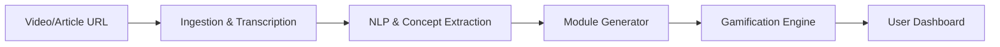

<<<<<<< HEAD

# 🧠 AIDucate

> **Your interactive GenAI-powered learning companion.**

AIDucate transforms the passive consumption of videos, blogs, and online courses into **active, engaging, and gamified learning experiences** — personalized to each user’s needs.


## 📚 Features

- 🎥 **YouTube-to-Learning Modules** – Paste a video link to auto-generate:
  - Smart roadmap
  - Context-based challenges
  - Practice problems with validation
  - Real-world applications

- 📄 **Content Adaptation** – Works with blogs, articles, transcripts, and course pages.

- 🧩 **Gamified Learning Layer**
  - Earn XP, maintain streaks, and level up
  - Personalized learning tasks based on performance

- 🤖 **AI-Powered Intelligence**
  - Built using Llama + Gemini for dynamic adaptation
  - Tailored to your style of learning

- 📊 **Progress Tracking**
  - Streaks, skill growth, and mastery graphs

---

## 🛠 Tech Stack

| Layer      | Tech                      |
|------------|---------------------------|
| Frontend   | React + Tailwind + Vite   |
| Extension  | TypeScript                |
| AI Models  | Llama (Ollama), Gemini    |
| Backend    | Node.js + Express         |
| Database   | PostgreSQL / MongoDB      |
| Hosting    | Vercel                    |

---

## 🌍 Use Cases

- **Students** – Turn lectures into active learning modules
- **Professionals** – Convert blogs and docs into skill paths
- **Corporates** – Automate onboarding and internal training
- **NGOs/Govt** – Convert public policies into digestible guides
- **Media** – Make news & articles interactive and memorable

---

## 🔮 Future Roadmap

- 📱 Mobile app with offline support
- 🧠 AI Memory Engine (Spaced Repetition)
- 🌐 Language localization (Bharat + global)
- 🧩 Plugin ecosystem for LMS/orgs
- 🎓 Career mapping through skill trees
- 💼 Creator marketplace for custom modules

---

## 📦 Installation & Setup

1. **Clone the repo**
   ```bash
   git clone https://github.com/your-username/aiducate.git
   cd aiducate


2. **Install dependencies**

   ```bash
   npm install
   ```

3. **Start the development server**

   ```bash
   npm run dev
   ```

4. **Backend Setup**

   * Configure `.env` for Node + Express
   * Start backend:

     ```bash
     npm run server
     ```

---


## 📊 Comparison

| Feature                      | AIDucate | Duolingo | ChatGPT |
| ---------------------------- | -------- | -------- | ------- |
| Live content adaptation      | ✅        | ❌        | ✅       |
| Auto learning module gen     | ✅        | ❌        | ❌       |
| Personalized progression     | ✅        | ✅        | ❌       |
| Gamified learning experience | ✅        | ✅        | ❌       |

---

## 🧑‍💻 Contributors

Made with ❤️ by **Team Envisioneers**
=======
# BrainBolt: GenAI‑Powered Active Learning Companion 📘

[](LICENSE) [](https://github.com/your-org/AI-Ducate/actions) [](https://codecov.io/gh/your-org/AI-Ducate)

**Transform passive content into engaging, gamified learning experiences**

---

## 🔮 Vision

**Reinvent online learning** by turning any video, article, or course into an **interactive, personalized, and game‑like journey**, so knowledge doesn’t just get consumed—it sticks.

---

## 🚨 Problem Statement

### Industry Context

* **83% of learners** struggle to retain information from videos and articles.
* **65% course drop‑off** in self‑paced learning due to lack of engagement.
* **Micro‑learning demand** is rising for on‑the‑go skill acquisition.

### Pain Points

| Category             | Specific Challenges                          |
| -------------------- | -------------------------------------------- |
| **Passive Learning** | One‑way content; no immediate feedback       |
| **Low Retention**    | Forget >50% of material within a week        |
| **Demotivation**     | No incentives, streaks, or social engagement |
| **Content Silos**    | Scattered across YouTube, blogs, PDFs, LMS   |

### Market Gap Analysis

| Solution | Limitation                    | AI‑Ducate Opportunity                    |
| -------- | ----------------------------- | ---------------------------------------- |
| YouTube  | No built‑in assessments       | Auto‑generate quizzes, flashcards        |
| Coursera | Paywalled static quizzes      | Free core; adaptive, modular assessments |
| Anki     | Manual flashcard creation     | AI‑driven spaced‑repetition flashcards   |
| Moodle   | Complex setup, low engagement | Easy plugin; real‑time gamification      |

---

## 🛠️ Solution Overview

**Content-to-Quiz Pipeline**



**Highlights:** Ingest any media ➔ extract concepts ➔ generate MCQs, flashcards, code challenges ➔ adaptive gamification.

---

## 🏗️ Architecture

```mermaid
flowchart TB
  subgraph Client
    FE[Web App (React + Tailwind)] -->|API| BE
    FE --> Ext[Browser Extension]
    FE --> Mobile[Flutter App]
  end

  subgraph Server
    BE[Node.js + Express]
    AI[AI Services: Llama, Gemini]
    DB[(PostgreSQL / MongoDB)]
    Cache[(Redis)]
    Queue[(RabbitMQ)]
  end

  FE --> BE
  Ext --> BE
  Mobile --> BE
  BE --> AI
  BE --> DB
  BE --> Cache
  BE --> Queue

  DB -->|Metrics| MetricsDB[(TimescaleDB)]
```

---

## 🌟 Key Features

1. **Content Ingestion**

   * YouTube/Vimeo API, PDF & HTML scraping
   * Whisper & Web Speech for transcripts
   * Timestamp alignment & segmentation

2. **Dynamic Module Generation**

   * MCQs, fill‑in‑blanks, coding challenges
   * Auto‑hint & feedback system

3. **Gamification**

   * XP, badges, streaks, leaderboards
   * Adaptive difficulty based on performance

4. **Personalization**

   * Learning style detection (visual, textual, kinesthetic)
   * Smart recommendations & spaced repetition

5. **Extensibility**

   * Browser extension for in‑page capture
   * LMS plugin (Moodle/Canvas) via LTI
   * Public APIs for third‑party integration

---

## 👥 Target Audience

| Role              | Use Case                  | Benefit                          |
| ----------------- | ------------------------- | -------------------------------- |
| **Students**      | Active recall for courses | ↑ Retention, ↓ study time        |
| **Professionals** | Upskill from blogs & docs | On‑demand practice               |
| **Educators**     | Interactive assignments   | Auto‑grading & cohort analytics  |
| **Enterprises**   | Scalable training         | Engagement & compliance tracking |

---

## 🚀 Installation & Setup

**Prerequisites:** Node.js v18+, Docker (optional), PostgreSQL/MongoDB, Redis, RabbitMQ.

1. Clone the repo:

```bash
git clone https://github.com/Mohfazam/BrainBolt
cd BrainBolt
```

2. Install dependencies:

```bash
# Backend
cd backend && npm install
# Frontend
cd ../frontend && npm install
```

3. Configure `.env` files in `backend/` and `frontend/` (see `.env.example`).
4. Run services:

```bash
# Backend
cd backend && npm run dev
# Frontend
cd ../frontend && npm run dev
```

---

## 🔧 Testing & QA

* **Unit Tests:** Jest & React Testing Library (85%+ coverage)
* **Integration Tests:** Supertest for API endpoints
* **End‑to‑End:** Cypress for user flows
* **CI Enforcement:** Coverage, lint, and type checks on each PR

---

## 🚢 Deployment & CI/CD

* **CI:** GitHub Actions (lint, test, coverage)
* **CD:** Docker images → AWS ECS / S3 + CloudFront
* **Monitoring:** Prometheus + Grafana dashboards
* **Alerts:** Slack & PagerDuty integrations

---

## 🛠️ Development Workflow

1. `git checkout -b feature/<name>`
2. Implement & test
3. `npm run lint && npm run format`
4. Push & open PR against `main`
5. CI runs checks; merge after approvals

---

## 🤝 Contributing

Please read \[CONTRIBUTING.md] before submitting patches.

---

## 📜 Code of Conduct

We follow the \[Contributor Covenant v2.1]. Please be respectful and inclusive.
>>>>>>> 1b2274f2adf54e8d50b5106abe59e791250413e1

---

## 📄 License

<<<<<<< HEAD
This project is licensed under the [MIT License](./LICENSE).

---

> “The internet has enough content. It’s time we made it *stick*.”

=======
MIT License. See \[LICENSE].

---

## 📸 System Flow Diagram


*End-to-end flow from ingestion, concept detection, module generation to gamified delivery.*

---

> “Learning isn’t about consuming content—it’s about transforming it into skills.”
>>>>>>> 1b2274f2adf54e8d50b5106abe59e791250413e1
