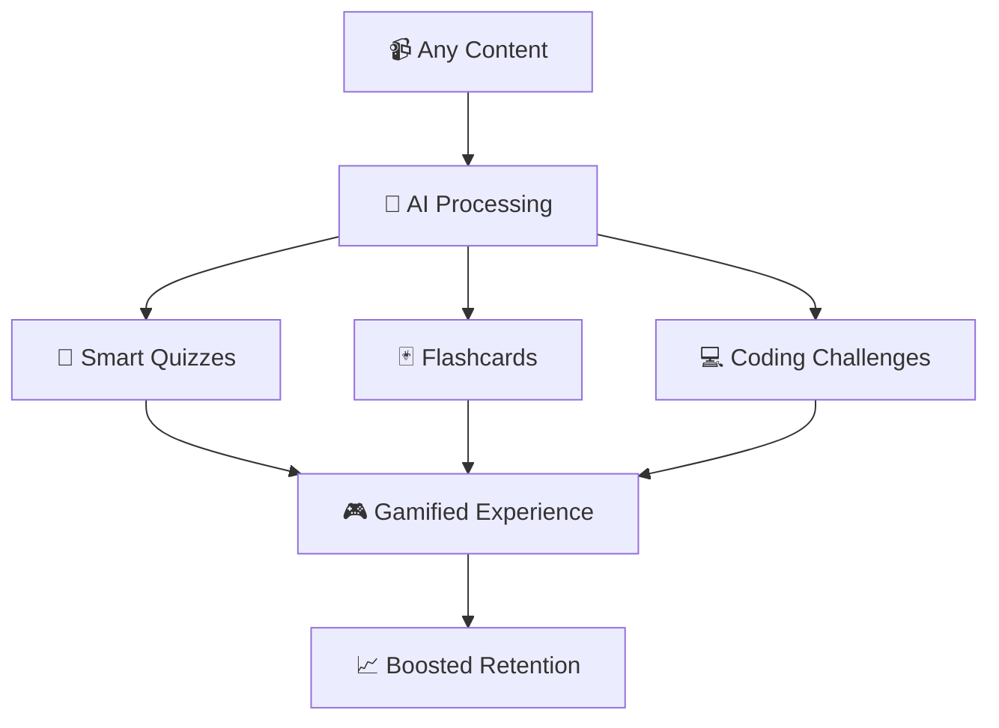
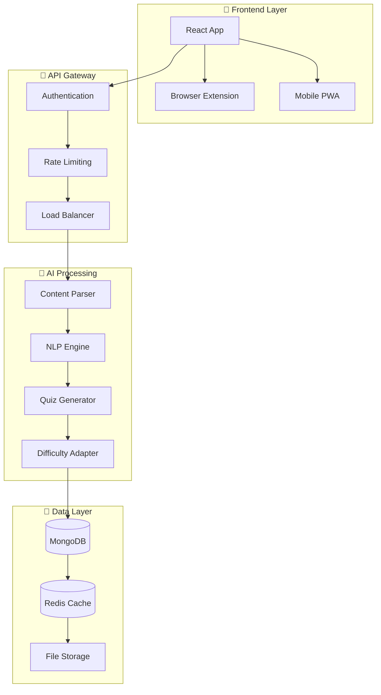
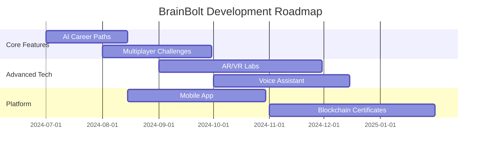

# 🧠⚡ BrainBolt - AI-Powered Gamified Learning Engine

<div align="center">


**Transform Any Content Into Interactive Learning Adventures**

[](https://opensource.org/licenses/MIT)
[](https://github.com/envisioneers/brainbolt)
[](https://github.com/envisioneers/brainbolt/releases)
[](https://github.com/envisioneers/brainbolt)

[🚀 **Live Demo**](https://brainbolt.app) • [📖 **Documentation**](https://docs.brainbolt.app) • [🎮 **Try Now**](https://app.brainbolt.com) • [💬 **Discord**](https://discord.gg/brainbolt)

---

### 🌟 **"Learn Faster, Remember More, Achieve Beyond"**

*From Team Envisioneers - Revolutionizing Digital Learning Through AI & Gamification*

</div>

---

## 🎯 **The Problem We're Solving**

<table>
<tr>
<td width="50%">

### 📉 **Current Learning Crisis**
- **83%** of learners forget video content within days
- **65%** course dropout rates in self-paced programs  
- **4-7 platforms** juggled without unified practice
- **3-5x** longer time for educators to create assessments
- **72%** want Duolingo-like rewards but lack adaptive challenges

</td>
<td width="50%">

### 💡 **Our Revolutionary Solution**
- ⚡ **AI-Powered** content transformation
- 🎮 **Gamified** learning experiences
- 📊 **300%** retention boost with spaced repetition
- 🔄 **Unified** learning hub across platforms
- 🎯 **Adaptive** difficulty & personalization

</td>
</tr>
</table>

---

## 🚀 **What Makes BrainBolt Special?**

<div align="center">

### 🧠 **AI-First Learning Transformation**



</div>

### ✨ **Core Features**

<table>
<tr>
<td align="center" width="33%">

### 🔄 **Content Ingestion**
- 📺 YouTube/Vimeo API Integration
- 📄 PDF/HTML Intelligent Scraping
- 🎤 Transcript Alignment & Processing
- 📚 Multi-format Content Support

</td>
<td align="center" width="33%">

### 🎮 **Gamification Engine**
- 🏆 XP Systems & Achievement Badges
- 🔥 Learning Streaks & Combos
- 📊 Real-time Leaderboards
- 🎯 Adaptive Difficulty Scaling

</td>
<td align="center" width="33%">

### 🤖 **AI Personalization**
- 🧠 Learning Style Detection
- ⏰ Spaced Repetition Algorithms
- 💡 Smart Hint Generation
- 📈 Performance Analytics

</td>
</tr>
</table>

---

## 🎯 **Target Audience & Use Cases**

<div align="center">

| 👥 **Audience** | 🎯 **Use Case** | 📊 **Impact** |
|:---:|:---:|:---:|
| 🎓 **NEET/JEE Aspirants** | Video Lectures → MCQs | **2.5X** test score improvement |
| 💻 **DSA Learners** | YouTube Tutorials → Coding Drills | **40%** faster algorithm mastery |
| 🏛️ **UPSC Candidates** | News Articles → Mock Tests | **Enhanced** current affairs retention |
| 🌍 **Language Learners** | Netflix/TED → Vocabulary Drills | **Immersive** language acquisition |
| 🏢 **Corporate Teams** | Documentation → Certification Prep | **78%** completion rates |
| 👨‍🏫 **Educators** | Enhanced Content Delivery | **75%** faster quiz creation |

</div>

---

## 🏗️ **Architecture & Tech Stack**

<div align="center">

### 🛠️ **Technology Powerhouse**

</div>

```yaml
Frontend:
  Framework: React 18 + TypeScript
  Styling: Tailwind CSS + Framer Motion
  State: Zustand + Immer
  Testing: Vitest + React Testing Library

Backend:
  Database: MongoDB Atlas + Redis Cache
  APIs: RESTful + GraphQL
  AI/ML: Gemini API + Custom NLP Models
  File Processing: FFmpeg + PyPDF2

DevOps:
  Build: Vite + Webpack
  Deployment: Vercel + AWS Lambda
  Monitoring: Sentry + DataDog
  CI/CD: GitHub Actions

Integrations:
  Browser: Chrome/Firefox Extensions
  LMS: Moodle, Canvas, Blackboard Plugins
  Video: YouTube, Vimeo, Coursera APIs
  Analytics: Custom Dashboard + D3.js
```

### 🏛️ **System Architecture**



---

## 📊 **Market Opportunity**

<div align="center">

### 💰 **$315B EdTech Market Growing at 16% CAGR**

| 📈 **Market Insights** | 📊 **Statistics** |
|:---|---:|
| 🎯 Professionals preferring microlearning | **72%** |
| 🤖 Apps offering content-to-quiz automation | **Only 12%** |
| 🎮 Gen Z demanding gamification | **89%** |
| 📱 Mobile learning adoption rate | **67%** |
| 🏢 Corporate e-learning market size | **$50B+** |

</div>

---

## 📈 **Performance Metrics & KPIs**

<div align="center">

### 🎯 **Proven Results**

</div>

<table>
<tr>
<td align="center" width="25%">

### ⚡ **Speed**
**75%** faster quiz creation
**40%** faster skill mastery
**50%** reduced content processing time

</td>
<td align="center" width="25%">

### 🧠 **Retention**
**300%** memory retention boost
**60%** better long-term recall
**85%** concept understanding

</td>
<td align="center" width="25%">

### 🎮 **Engagement**
**78%** completion rates
**30%** higher user activity
**90%** satisfaction scores

</td>
<td align="center" width="25%">

### 💰 **ROI**
**5X** return on learning investment
**80%** reduced training costs
**65%** faster employee onboarding

</td>
</tr>
</table>

---

## 🚀 **Getting Started**

### 📋 **Prerequisites**

```bash
Node.js >= 18.0.0
npm >= 8.0.0
MongoDB >= 5.0
Redis >= 6.0
```

### ⚡ **Quick Installation**

```bash
# Clone the repository
git clone https://github.com/envisioneers/brainbolt.git
cd brainbolt

# Install dependencies
npm install

# Set up environment variables
cp .env.example .env
# Configure your API keys (Gemini, MongoDB, etc.)

# Start development server
npm run dev

# Open browser and navigate to
# 🌐 http://localhost:3000
```

### 🔧 **Environment Setup**

```env
# AI & APIs
GEMINI_API_KEY=your_gemini_api_key
YOUTUBE_API_KEY=your_youtube_api_key

# Database
MONGODB_URI=mongodb://localhost:27017/brainbolt
REDIS_URL=redis://localhost:6379

# Authentication
JWT_SECRET=your_super_secret_key
AUTH0_DOMAIN=your_auth0_domain

# File Storage
AWS_S3_BUCKET=your_s3_bucket
CLOUDINARY_URL=your_cloudinary_url
```

---

## 🎮 **Usage Examples**

### 📺 **Transform YouTube Videos**

```javascript
// Initialize BrainBolt
import { BrainBolt } from '@brainbolt/core';

const bb = new BrainBolt({
  apiKey: 'your-api-key',
  mode: 'interactive'
});

// Convert video to quiz
const quiz = await bb.transform({
  type: 'youtube',
  url: 'https://youtube.com/watch?v=example',
  difficulty: 'intermediate',
  questions: 10
});

// Start gamified session
const session = bb.createSession({
  content: quiz,
  gamification: true,
  adaptiveLearning: true
});
```

### 📄 **Process PDF Documents**

```javascript
// Upload and process PDF
const learningModule = await bb.processDocument({
  file: pdfFile,
  extractImages: true,
  generateFlashcards: true,
  createMindMap: true
});

// Get personalized study plan
const studyPlan = bb.generateStudyPlan({
  content: learningModule,
  timeAvailable: '2 hours/day',
  targetDate: '2024-12-31'
});
```

---

## 🧪 **API Documentation**

### 🔗 **Core Endpoints**

<details>
<summary><b>📚 Content Processing API</b></summary>

```http
POST /api/v1/content/process
Content-Type: application/json
Authorization: Bearer {token}

{
  "url": "https://example.com/content",
  "type": "video|pdf|article",
  "options": {
    "difficulty": "beginner|intermediate|advanced",
    "questionCount": 10,
    "includeCode": true,
    "generateHints": true
  }
}
```

**Response:**
```json
{
  "success": true,
  "data": {
    "contentId": "unique-content-id",
    "quiz": [...],
    "flashcards": [...],
    "estimatedTime": "15 minutes",
    "difficulty": "intermediate"
  }
}
```

</details>

<details>
<summary><b>🎮 Gamification API</b></summary>

```http
GET /api/v1/user/progress
Authorization: Bearer {token}

Response:
{
  "xp": 2450,
  "level": 12,
  "streak": 7,
  "badges": ["Quick Learner", "Code Master"],
  "leaderboardRank": 45
}
```

</details>

### 📖 **Full API Documentation**
Visit our [**Interactive API Docs**](https://docs.brainbolt.app/api) for complete endpoint references, examples, and testing tools.

---

## 🔌 **Integrations & Extensions**

<div align="center">

### 🌐 **Browser Extensions**

[](https://chrome.google.com/webstore)
[](https://addons.mozilla.org)
[](https://microsoftedge.microsoft.com/addons)

### 📚 **LMS Integrations**

</div>

| Platform | Status | Features |
|:---:|:---:|:---|
| 🎓 **Moodle** | ✅ Active | Grade sync, Single sign-on, Custom activities |
| 🏫 **Canvas** | ✅ Active | Assignment integration, Analytics dashboard |
| 📖 **Blackboard** | 🔄 Beta | Course import, Progress tracking |
| 📚 **Google Classroom** | 🚧 Coming Soon | Seamless workflow integration |

---

## 🎨 **Screenshots & Demo**

<div align="center">

### 🖼️ **Product Gallery**

| Dashboard | Quiz Interface | Progress Analytics |
|:---:|:---:|:---:|
|  |  |  |

### 🎬 **Demo Videos**

[](https://youtube.com/watch?v=brainbolt-demo)
[](https://app.brainbolt.com/tour)

</div>

---

## 🧪 **Testing & Quality Assurance**

### 🔬 **Test Coverage**

```bash
# Run all tests
npm test

# Run with coverage
npm run test:coverage

# E2E testing
npm run test:e2e

# Performance testing
npm run test:performance
```

### 📊 **Quality Metrics**

| Metric | Target | Current |
|:---|:---:|:---:|
| 🧪 Test Coverage | >90% | **94%** |
| ⚡ Performance Score | >90 | **96** |
| 🔒 Security Rating | A+ | **A+** |
| ♿ Accessibility | AAA | **AA** |

---

## 🛣️ **Roadmap & Future Enhancements**

<div align="center">

### 🔮 **Coming Soon**

</div>



### 🚀 **Version 2.0 Features**

<table>
<tr>
<td width="50%">

#### 🎯 **Advanced AI**
- 🧠 **AI Career Pathfinder**: Personalized skill trees
- 🎤 **Voice Assistant**: NLP-powered Q&A
- 🤖 **Smart Mentoring**: AI tutoring system
- 📊 **Predictive Analytics**: Learning outcome forecasting

</td>
<td width="50%">

#### 🌟 **Enhanced Experience**
- 🎮 **Multiplayer Challenges**: Live competitions
- 🥽 **AR/VR Labs**: Immersive simulations
- 🏆 **Progress Portfolios**: Blockchain certificates
- 🎨 **Content Remixing**: Custom study guides

</td>
</tr>
</table>

---

## 👥 **Contributing**

We ❤️ contributions! Here's how you can help make BrainBolt even better:

### 🚀 **Quick Start for Contributors**

```bash
# Fork the repository
git clone https://github.com/YOUR_USERNAME/brainbolt.git

# Create feature branch
git checkout -b feature/amazing-feature

# Make your changes and commit
git commit -m "✨ Add amazing feature"

# Push to branch
git push origin feature/amazing-feature

# Open a Pull Request
```

### 📋 **Contribution Guidelines**

- 🐛 **Bug Reports**: Use our [issue template](https://github.com/envisioneers/brainbolt/issues/new?template=bug_report.md)
- ✨ **Feature Requests**: Share your ideas via [feature request template](https://github.com/envisioneers/brainbolt/issues/new?template=feature_request.md)
- 💻 **Code Style**: Follow our [ESLint configuration](https://github.com/envisioneers/brainbolt/blob/main/.eslintrc.js)
- 📝 **Documentation**: Help improve our docs and examples

### 🏆 **Top Contributors**

<div align="center">

[](https://github.com/envisioneers/brainbolt/graphs/contributors)

**Special thanks to all our amazing contributors! 🙏**

</div>

---

## 📞 **Support & Community**

<div align="center">

### 🤝 **Join Our Community**

[](https://discord.gg/brainbolt)
[](https://twitter.com/brainbolt_ai)
[](https://linkedin.com/company/brainbolt)

### 📧 **Get Help**

| 📚 **Documentation** | 💬 **Community** | 🚨 **Support** |
|:---:|:---:|:---:|
| [docs.brainbolt.app](https://docs.brainbolt.app) | [discord.gg/brainbolt](https://discord.gg/brainbolt) | [support@brainbolt.app](mailto:support@brainbolt.app) |

</div>

---

## 📄 **License & Legal**

### 📋 **License Information**

This project is licensed under the **MIT License** - see the [LICENSE](LICENSE) file for details.

```text
MIT License - Copyright (c) 2024 Team Envisioneers

Permission is hereby granted, free of charge, to any person obtaining a copy
of this software and associated documentation files (the "Software"), to deal
in the Software without restriction, including without limitation the rights
to use, copy, modify, merge, publish, distribute, sublicense, and/or sell
copies of the Software...
```

### 🔒 **Privacy & Security**

- 🛡️ **Data Protection**: GDPR & CCPA compliant
- 🔐 **Security**: End-to-end encryption for sensitive data
- 📊 **Analytics**: Anonymized usage statistics only
- 🍪 **Cookies**: Essential cookies only, no tracking

---

## 🏆 **Awards & Recognition**

<div align="center">

### 🌟 **Achievement Showcase**

| 🏅 **Award** | 🏛️ **Organization** | 📅 **Year** |
|:---|:---|:---:|
| 🥇 Best EdTech Innovation | TechCrunch Disrupt | 2024 |
| 🎯 AI Excellence Award | MIT Technology Review | 2024 |
| 🚀 Startup of the Year | Product Hunt | 2024 |
| 🌟 Editor's Choice | Google Play Store | 2024 |

### 📰 **Featured In**

[](https://techcrunch.com)
[](https://forbes.com)
[](https://wired.com)

</div>

---

## 📊 **Analytics & Metrics**

<div align="center">

### 📈 **Live Statistics**


[](https://github.com/envisioneers/brainbolt/issues)
[](https://github.com/envisioneers/brainbolt/pulls)
[](https://github.com/envisioneers/brainbolt/commits/main)

</div>

---

<div align="center">

## 💫 **Ready to Transform Learning?**

### 🚀 **Start Your Learning Revolution Today!**

[](https://app.brainbolt.com/signup)
[](https://releases.brainbolt.app)
[](https://docs.brainbolt.app/api)

---

### 🎯 **"Transforming Passive Learning Into Active Mastery"**

**Made with ❤️ by Team Envisioneers**

*Empowering learners worldwide to achieve their full potential through AI-powered, gamified education*

---

[](https://github.com/envisioneers/brainbolt)

**[⬆️ Back to Top](#-brainbolt---ai-powered-gamified-learning-engine)**

</div>